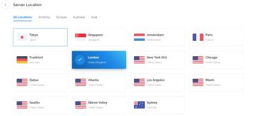
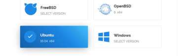
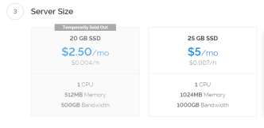
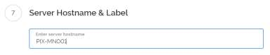
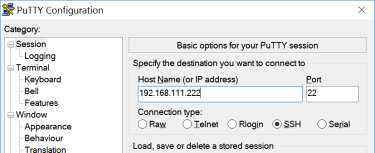
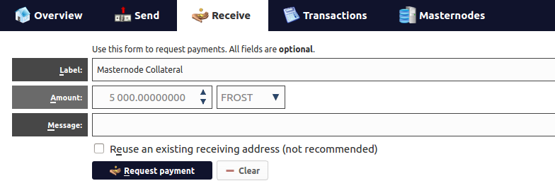
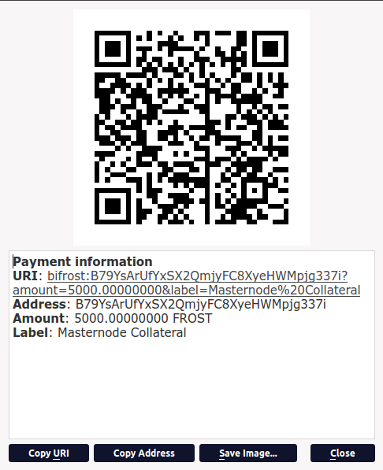
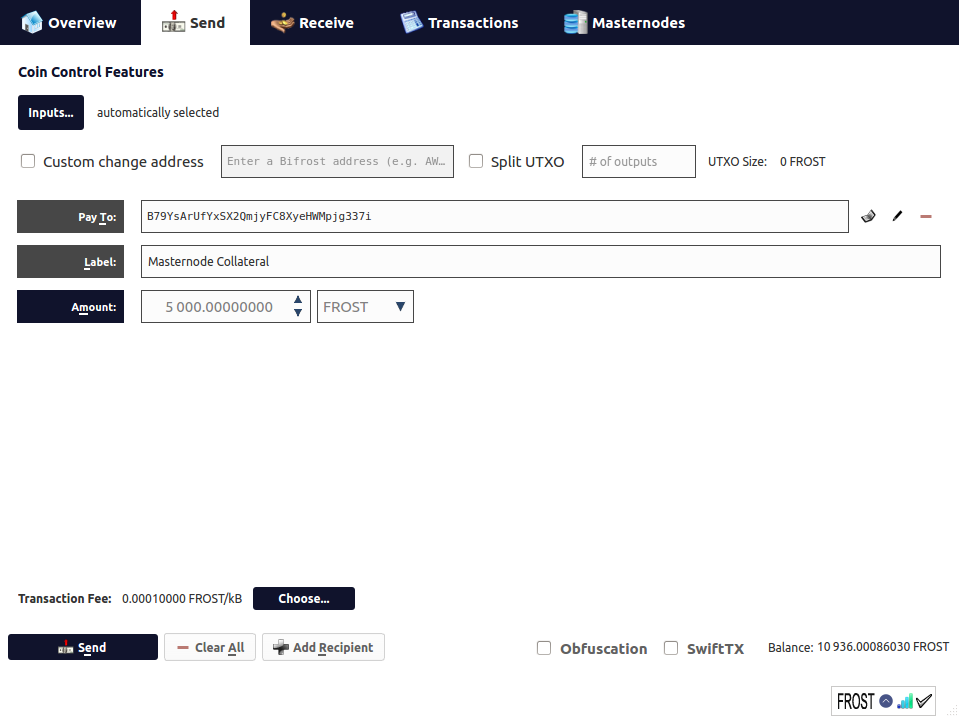
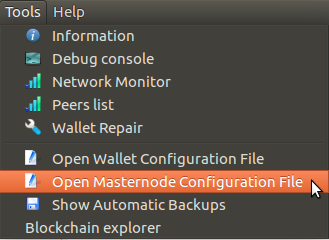

# Masternode Setup Guide - Local Wallet with VPS Server

There are several ways to run a masternode on the **Bifrost** network, but this is by far the most 
secure and popular method.  In this configuration, your local wallet contains collateral coins and controls
one or more masternode servers running on remote cloud hardware.  Because your local wallet holds the coins
and private keys for your masternodes, it is called a **"hot"** wallet, and the remote servers are known as
**"cold"** nodes.

**This configuration has 3 primary advantages:**
- Cold nodes are the public face of your masternodes, and since they hold no coins, a breach of your server doesn't put your collateral coins at risk.
- Most consumer internet connections do not provide static IP addresses, which is a requirement for Bifrost masternodes.
- VPS servers run 24/7 and continue to earn rewards while your local wallet is closed.


## What you will need:
- A local computer running a copy of the Bifrost-QT wallet
- A VPS cloud server running Ubuntu 16.04.  We recommend [Vultr](https://www.vultr.com/) as a provider.
- PuTTY or similar SSH terminal software for connecting to your remote servers [download](https://www.chiark.greenend.org.uk/~sgtatham/putty/latest.html)
- 5,000+ FROST to use as collateral for your masternode
- Some light Linux knowledge

## Creating your VPS Server
From the Vultr home page, create a new user account for billing.
Once you are logged in to your new account, click the Servers icon on the left navigation bar and click the plus symbol


Next, choose one of the many locations to host your server.  Any of the locations will work for Bifrost.



Now choose Ubuntu v16.04 as the server type.  Note - Although Bifrost may work on several versions of Linux, we have only tested and support installation under Ubuntu 16.04.



Select the size of the server you want to run.  For a single masternode, we recommend the 1024MB size, which costs $5.00/month.



Leave the Additional Features, Startup Script, SSH Keys, and Firewall Group sections blank.

Give your server an easy to remember hostname and/or label



Click the Deploy Now button at the bottom of your screen.

Your new server will then be launched, configured, and assigned a new IP address.  Please make note of the IP address and the password for the next step of the installation.


Once your new server is running, you will need to open a terminal session to install the Bifrost software.  MacOS and Linux users can open a terminal from the command line using ssh.  For Windows users, launch the copy of PuTTY you previously downloaded and installed.

Enter the IP address of your new server in hostname box, and click the **open** button.



A terminal screen will open and ask you to log in

User: root

Password: (the password from your Vultr server detail screen)

## Install the Bifrost software on your VPS

**You now have two options for installation:**
- Manually download and compile the Bifrost source

  See the [guide](https://github.com/bifrost-actual/bifrost-resources/blob/master/linux-masternode-setup.md) for specific instructions
- Use the [masternode-install-script](https://github.com/bifrost-actual/bifrost-resources/blob/master/README.md) to prepare and install your server

## Prepare your local control wallet

**What you will need from your VPS setup:**
- The masternode private key generated by the install script or manually with the `masternode genkey` command.  This is the key in the bifrost.conf file on your masternode server.
- The IP address of your VPS server.

**Set up your collateral address**

- Open your local QT wallet, and go to the receive tab.
- In the label field, enter some identifying text (i.e. **MN1 Collateral**)
- In the amount field, type **5000**
- Make sure the **Reuse an existing receiving address** checkbox is not selected.

  
  
- Click the **Request payment** button
- A pop-up window will open with the payment request.  Click the **Copy address** button and close the pop-up

  
  
- Click the **send** tab.
- Paste the address into the appropriate field
- In the amount field, type **5000** (It's **critical** that this amount is exactly **5000**, no more or less)
- Click the **Send** button.

  
- If your wallet is locked, you will have to enter your password to complete the send operation.

In your transaction log, there will be a new entry for payment to yourself.  Before you can start your masternode, this transaction has to receive **15 confirmations**.

Get your collateral transaction id
- Open your debug console and type `masternode outputs`
- If you have correctly send 5000 coins in a single transaction, you will see something like this:

  ```
  {
     "xaxaxaxaxaxaxaxaxaxaxaxaxaxaxaxaxaxaxaxaxaaxaxaxaxaxaxaxaxaxaxax" : "1"
  }
  ```
  The long string is the collateral transaction id (TX) and the number is the transaction index.
- Copy these values to a notepad file, along with your masternode private key and IP address.
- From the tools menu, select the menu item for **Open Masternode configuration file**

  
  
  This will open the file in your preferred text editor.  As you can see there is a description of the masternode definition format, and an example entry.
- Create a new entry for your masternode on a blank line following the example.  Note - The alias you use should be descriptive, but have no spaces in it. (i.e. **MN1** or **MyNode**)
- The IP address must include the port number of :9229
- The masternodeprivkey is the key you saved from your VPS installation.  This key tells the server that your wallet is the correct controller for it.  Never give this key to anyone!
- The collateral_output_txid is the long string you saved from the `masternode outputs` command in the debug console.  Note, this string should be entered *without quotes around it*
- The collateral_output_index is the number from the `masternode outputs` command.  Also without quotes.

  *All of these pieces of information must be entered on the same line, and separated by a single space...just like the example line.*
- Save and close this file, and restart your wallet.
- Open the Masternodes tab, and you should see an entry for your new node.  The status should say **MISSING**
- Once your collateral transaction has received 15 confirmations, you can start your masternode

IMPORTANT!

There is currently a bug in the QT wallet that will throw an error if you attempt to start your masternode by clicking any of the start buttons on the masternodes screen.  Until this bug has been resolved, open your debug console and type: `masternode start-alias` followed by the name you gave your masternode in the configuration file.  The response should say **success**.

Examples:
```
masternode start-alias MN1
```
or...
```
masternode start-alias MyNode
```
On the masternode screen, click the update status button and your masternode status should now say **ENABLED**

That's it, your masternode is now running.  It will take several minutes to register itself with the other masternodes on the network, after which the active clock on your list will start increasing.  Shortly after that, your wallet address should start receiving rewards!


